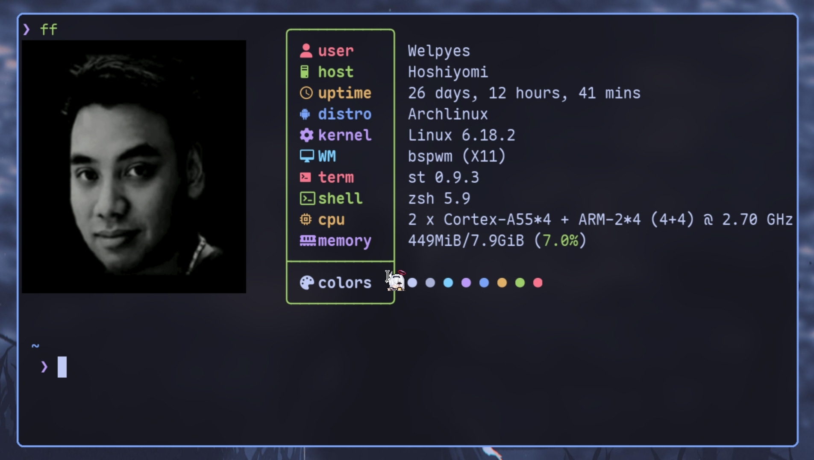

# Simple Terminal
Fast, simple and feature rich terminal



This patchset is based on [st-flexipatch](https://github.com/bakkeby/st-flexipatch) im very thankful for their repository

## Patches
- [anygeometry](https://st.suckless.org/patches/anygeometry/)
- [anysize](https://st.suckless.org/patches/anysize/)
- [background_image](https://st.suckless.org/patches/background_image/)
- [background_image_reload](https://st.suckless.org/patches/background_image/)
- [blinking_cursor](https://st.suckless.org/patches/blinking_cursor/)
- [bold_is_not_bright](https://st.suckless.org/patches/bold-is-not-bright/)
- [boxdraw](https://st.suckless.org/patches/boxdraw/)
- [delkey](https://st.suckless.org/patches/delkey/)
- [hidecursor](https://st.suckless.org/patches/hidecursor/)
- [ligatures](https://st.suckless.org/patches/ligatures/)
- [reflow](https://github.com/bakkeby/st-flexipatch)
- [sixel](https://gist.github.com/saitoha/70e0fdf22e3e8f63ce937c7f7da71809)
- [sync](https://st.suckless.org/patches/sync/)
- [Kitty Graphics](https://st.suckless.org/patches/kitty-graphics-protocol/)

## Installation 

you might need some dependencies, if theres missing just install it
```
# Void
xbps-install libXft-devel libX11-devel harfbuzz-devel libXext-devel libXrender-devel libXinerama-devel gd-devel

# Debian (and ubuntu probably)
apt install build-essential libxft-dev libharfbuzz-dev libgd-dev

# Arch
pacman -S gd base-devel

# Fedora (or Red-Hat based)
dnf install gd-devel libXft-devel

# SUSE (or openSUSE)
zypper in -t pattern devel_basis
zypper in gd-devel libXft-devel harfbuzz-devel

# Install font-symbola and libXft-bgra
```

### Configuration and installation

#### set up your font:
```c
// in line 8 you should find this:
static char *font = "Maple Mono NF:pixelsize=15:antialias=true:autohint=true";
```
change it `Maple Mono NF` to whatever you like.
you can download Maple Mono NF font [here](https://example-link.com)

#### setting up the background
```c
// in line 18 you should find this
static const char *bgfile = "/home/username/.config/st_wallpaper.ff";
```

change `username` to your username (e.g `"/home/username/.config/st_wallpaper.ff"`)<br><br>

then run(see help for more options)
```
./st-bg.sh -o 0 ~/image.png
```

then just:
```
make install clean PREFIX=$PREFIX
```

