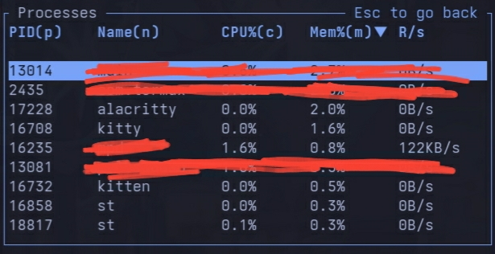

# st-terminal
Fast and "Simple" Terminal emulator from the suckless project. <br>


This patchset is based entirely on [St-Graphics](https://github.com/sergei-grechanik/st-graphics). Specifically, on the [graphics-with-patches](https://github.com/sergei-grechanik/st-graphics/tree/graphics-with-patches) branch. but removed some useless patches that isnt needed for modern use. And some useless newline ttywrite.

I also modified Xresources to include more options.

### Patches included in this patchset

- [Kitty graphics protocol](https://github.com/sergei-grechanik/st-graphics) - Renders images using the modern kitty protocol, this provides high quality image viewing directly in the terminal
- [Boxdraw](https://st.suckless.org/patches/boxdraw) - Renders texts in neat boxes so TUI programs dont have gaps between texts
- [xresources with signal reloading](https://st.suckless.org/patches/xresources-with-reload-signal/) - Configure st via Xresources and signal reloading. Modified it slightly to include more options.
- [Scrollback](https://st.suckless.org/patches/scrollback)
- [Wide glyph support](https://st.suckless.org/patches/glyph_wide_support/) - Fixes wide glyphs truncation
- [Ligatures](https://st.suckless.org/patches/ligatures) - Proper drawing of ligatures.
- [Appsync](https://st.suckless.org/patches/sync/) - Better draw timing to reduce flicker/tearing and improve animation smoothness.
- [Blinking cursor](https://st.suckless.org/patches/blinking_cursor/) - Allows the use of a blinking cursor.
- [Desktop entry](https://st.suckless.org/patches/desktopentry/) - This enables to find st in a graphical menu and to display it with a nice icon.
- [Drag n drop](https://st.suckless.org/patches/drag-n-drop/) - This patch adds [XDND Drag-and-Drop](https://www.freedesktop.org/wiki/Specifications/XDND/) support for st.
- [Dynamic cursor color](https://st.suckless.org/patches/dynamic-cursor-color/) - Swaps the colors of your cursor and the character you're currently on (much like alacritty).
- [Bold is not bright](https://st.suckless.org/patches/bold-is-not-bright/) - This patch makes bold text rendered simply as bold, leaving the color unaffected.
- [swap mouse](https://st.suckless.org/patches/swapmouse/) - This patch changes the mouse shape to the global default when the running program subscribes for mouse events, for instance, in programs like ranger, yazi and fzf.
- [Unfocused-cursor](https://st.suckless.org/patches/unfocused_cursor/) - Removes the outlined rectangle, making the cursor invisible when the window is unfocused.
- [Anysize](https://st.suckless.org/patches/anysize/) - this patch is applied
  and on by default. If you want the "expected" anysize behavior (no centering),
  set `anysize_halign` and `anysize_valign` to zero in `config.h`.
- Support for XTWINOPS control sequences.
- Suport for font decorations like underlines, colour and styling.

### Default Keybindings<br>

```
(Zoom)
ctrl + {=, shift + plus}     Zoom in 
ctrl + minus                 Zoom Out
ctrl + g                     Reset zoom
```

### Installation

First off you need to install the dependencies if you havent already

  Core Dependencies
   * X11: Xlib, libX11, libXft, libXrender
   * Font Handling: fontconfig, freetype2
   * Text Shaping: harfbuzz (for ligatures support)
   * Image Loading: imlib2 (likely for graphics/sixel support)
   * System/Compression: zlib, libutil, libm
   * Build Tools: gcc, make, pkg-config, tic (terminfo compiler)
  
  Runtime Dependency:
   * Config Loader: xorg-xrdb

  Platform-Specific (Android/Termux)
   * [libshmemu](https://github.com/Welpyes/libshmemu): Used for shared memory emulation on Android.

#### Compilation

```bash
git clone https://github.com/welpyes/st.git
cd st
make
make install

```
#### Apply your own settings dynamically

By default, the terminal doesnt ship with any colourschemes or font so you have to provide it yourself in `~/.Xresources`. <br>
so to load stuff on startup, please put this in your `.xinitrc` or your startup script
```bash
xrdb -merge ~/.Xresources
```

**Font and Terminal settings** <br>

- `st.font` - Main font family used by the terminal using the fontconfig syntax.
- `st.font2.N` - You can add as much font as you want by incrementing the `N`, same syntax as above.
- `st.termname` - Terminal name basically. defauly is `st-256color`.
- `st.borderpx` - Terminal margins, measured in pixels.

```Xresources
st.font:                Ioskeley Mono:style:regular:pixelsize=18
st.font2.0:             Symbols Nerd Font Mono:pixelsize=18
st.font2.1:             Whatever Font Mono:pixelsize=18
st.termname:            st-256color
st.borderpx:            1
```

**Behavior and other settings** <br>

- `st.alpha` - Changes the opacity of the terminal.
- `st.tabspaces` - Idk if it works but it makes the tab spaces, and you can specify the amount of them.
- `st.blinktimeout` - The blink interval of the prompt, highly depends on your shell's setup.
- `st.bellvolume` - Idk what this is but i mapped it anyways
- `st.cursorstyle` - Changes the style of your cursor, highly depends on your shell's setup.
- `st.minlatency` & `st.maxlatency` - Latency between redraws pls read [Appsync](https://st.suckless.org/patches/sync/)
- `st.doubleclicktimeout` & `st.tripleclicktimeout` - Determines the double and triple click speed.
- `st.boxdraw` - toggles boxdraw; `1` for true, 0 for `false`
- `st.boxdraw_bold` - toggles boxdraw bold; `1` for true, 0 for `false`

```Xresources
st.alpha:               1.0
st.tabspaces:           2
st.blinktimeout:        500
st.bellvolume:          0
st.cursorstyle:         1
st.minlatency:          2
st.maxlatency:          33
st.doubleclicktimeout:  300
st.tripleclicktimeout:  600
st.boxdraw:             1
st.boxdraw_bold:        1
```

**Colorscheme** <br>

Just edit these values

```Xresources
! Bg & Fg
st.background:          #1a1b26
st.foreground:          #c0caf5
st.cursorColor:         #c0caf5

! Black + DarkGrey
st.color0:              #15161e
st.color8:              #414868

! DarkRed + Red
st.color1:              #f7768e
st.color9:              #f7768e

! DarkGreen + Green
st.color2:              #9ece6a
st.color10:             #9ece6a

! DarkYellow + Yellow
st.color3:              #e0af68
st.color11:             #e0af68

! DarkBlue + Blue
st.color4:              #7aa2f7
st.color12:             #7aa2f7

! DarkMagenta + Magenta
st.color5:              #bb9af7
st.color13:             #bb9af7

! DarkCyan + Cyan
st.color6:              #7dcfff
st.color14:             #7dcfff

! LightGrey + White
st.color7:              #a9b1d6
st.color15:             #c0caf5
```

put these settings in `~/.Xresources`<br>
And load them using:
```bash
xrdb -merge ~/.Xresources
```
and either restart `st` or reload it using:
```bash
kill -USR1 $(pgrep -x st)
```

## Idle memory usage comparison

> [!NOTE]
> This is done on an old Samsung s9+ phone so results may vary <br>


